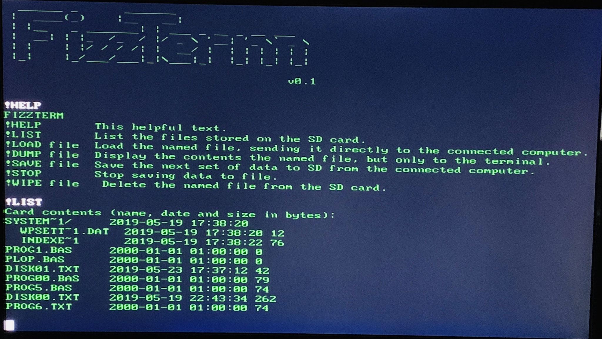
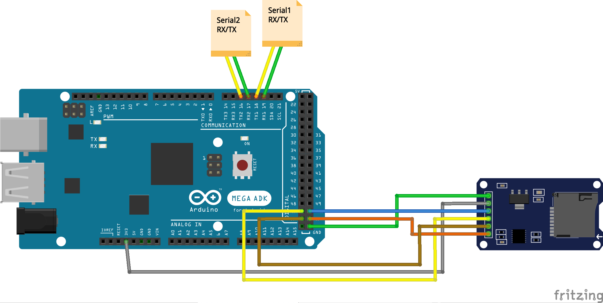

# FizzTerm

## A simple Arduino-based system for capturing and replaying serial data to SD card.

If you have built a retro-computer project from a kit, say, an Altair-Duino or an RC2014, you might be looking for a convenient way to load and save content such as BASIC or Assembler programs.

You *could* run a terminal application on a Windows or Mac device, and use it to capture content. However, if you have a dedicated terminal this might not be an option. This project creates a device that sits between your retro-computer and your terminal's RS232 connection, and is invisible until you use one of the supported commands.

Once activated, FizzTerm can save or load data to a SD card. For example, you might use it to capture a BASIC program, and then load it back later. Or you might even enter the program on your actual computer, and save it to the SD card so it can be loaded.

It's also quite fun to create a stand-alone terminal like this, to be perfectly honest.

## Hardware

The full list of parts is:

* An Arduino MEGA2560 or compatible
* An Arduino-compatible SD-Card reader. (These are available on Amazon very cheaply - something like five for $10)
* Two Arduino-compatible RS232-TTL adpators. (These are also available on Amazon for about $10 each)
* An extra serial cable.

Connect the SD-Card reader in the standard way (to CS, MSIO, MOSI, SCK, +3.3v and Ground) and the two serial adpators to 16,17 and 18,19 (and 3.3v and Gnd). [Here's a link](https://www.arduino.cc/en/Reference/SPI) to the Arduino page listing the correct pins to use. The MEGA actually prints TX1, RX1, TX2, RX2, TX3, RX3 on the board which is useful. The Arduino MEGA has a third serial port free - you could expand the project to be a software switch to select between multiple sources.

Housing a project like this is a little tricky as it can be difficult to cut out holes for the DB9 serial sockets in ABS plastic. You can of course 3D print a suitable enclosure, or repurpose an old, clunky manual serial select device that comes in a smallish steel box with DB9 sockets already mounted (and easily removed). 

In the end, things got out of hand for me, and [I built a complete terminal to house it](https://github.com/GrantMeStrength/FT1).

## Software

The source code for FizzTerm should work as-in on any Arduino MEGA (the MEGA, or compatible, is required because of the improved Serial port support over an Uno).

The one caveat is when using the SD.H library. By default, the SD.H library will send the results of a directory list to Serial, and we would like it sent to Serial1.

The simplest way around this is to copy the SD.H library, and then search and replace references to *Serial.* to *Serial1.* in the source code. Or just don't use the *!LIST* command - other commands will work fine.

(On the todo list is to rewrite everything to support SDFat library instead.)

## Operation

Disconnect your serial connection between your retro-computer and your terminal. Connect the terminal to Serial port 1 of the FizzTerm, and the retro-computer to Serial Port 2.

If you have connected all the RS232 cables correctly, and have all the RX/TX connections the right way around, when you power up the Arduino, you should see a welcome message on your terminal. If not, confirm all the connections and check the baud rate (by default 9600).

You are now free to use the retro-computer as you usually would. You should not notice any difference (except that you can use backspace in the original Microsoft BASIC application - you're welcome - as it sends input line by line, rather than character by character, which can break backspace), until you use a FizzTerm command, for example, !HELP.

FizzTerm commands all start with !, and will send text only to the terminal (except !LOAD of course).

For example, if you have a BASIC program you would like to save, you would perform the following steps.

1. Make sure the BASIC program is ready on your retro-computer.
2. Enter *!SAVE FILENAME.BAS*
3. Type *LIST*
4. Type *!STOP* or *CTRL-C*

The program should be stored on the SD card. You can confirm by typing:

*!LIST*

to see the capture file name, and then

*!DUMP FILENAME.BAS*

to display the contents on the terminal.

To re-load the BASIC program:

1. Type *NEW* on the retro-computer
2. Type *!LOAD FILENAME.BAS*

The file should be sent to the retro-computer.

You should be now able to type *LIST* and see the listing as if you had typed it.

## Other ideas

As mentioned, you could adapt the software and hardware to select between different serial inputs (one terminal, two retro-computers). At the moment, the !BAUD keyword toggles between speeds of 9600 and 115200 (the default speeds of an Altair-Duino and RC2014) but you could write code to cycle through the most common values.

Not every system can display and then receive text in a meaningful way. That is, a system may not list out assembler in a way which a program can load and re-assemble. You may have to get a little inventive. Isn't that what using retro-computers is all about? 

## Updates

I've added a few more features in v3.1.

1. You can toggle between baud rates (currently 9600 and 115200 with the !BAUD keyword). You can add support for other rates just as easily.

2. Keywords can be in uppercase or lowercase.

3. I found an oddity when playing Zork on the terminal connected to an Altair-Arduino system. It turns out that **Serial2.write(buffer)** is too fast, and makes bad things happen. Rewriting to send out chars one at a time with a tiny delay resolves the issue.